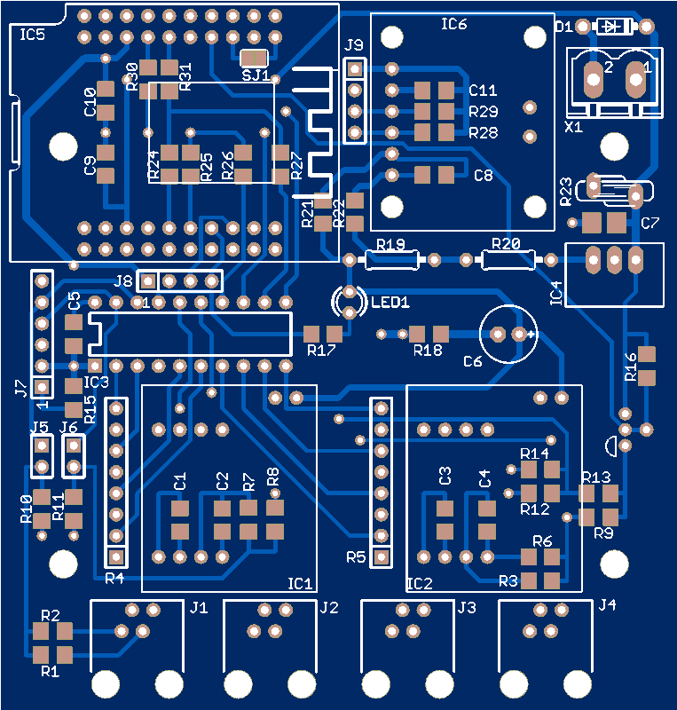
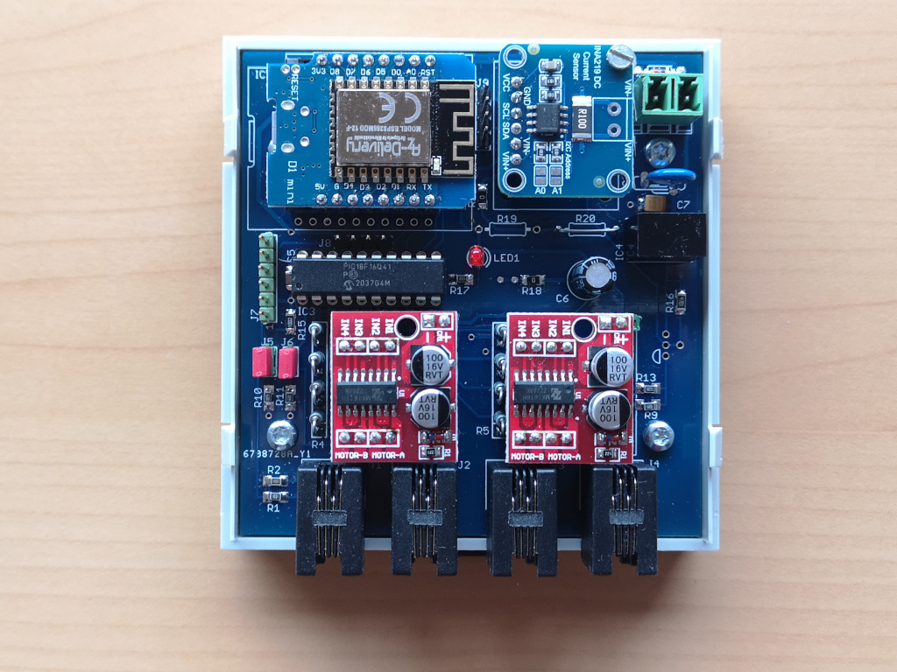

# This folder contains the schematics and hardware description

<table>
<tr>
  <td></td>
  <td></td>
</tr>  
</table>

- [x] A working sample is running using a breadboard.
- [x] First layout and Gerber files are available.
- [x] PCB built into housing, first desktop tests have passed.
- [x] Testing under real conditions (in progress).

## Block diagram
- todo -

## Schematics
- Schematics added as PDF

## Board and housing
- PCB design added as PDF
- PCB preview added
