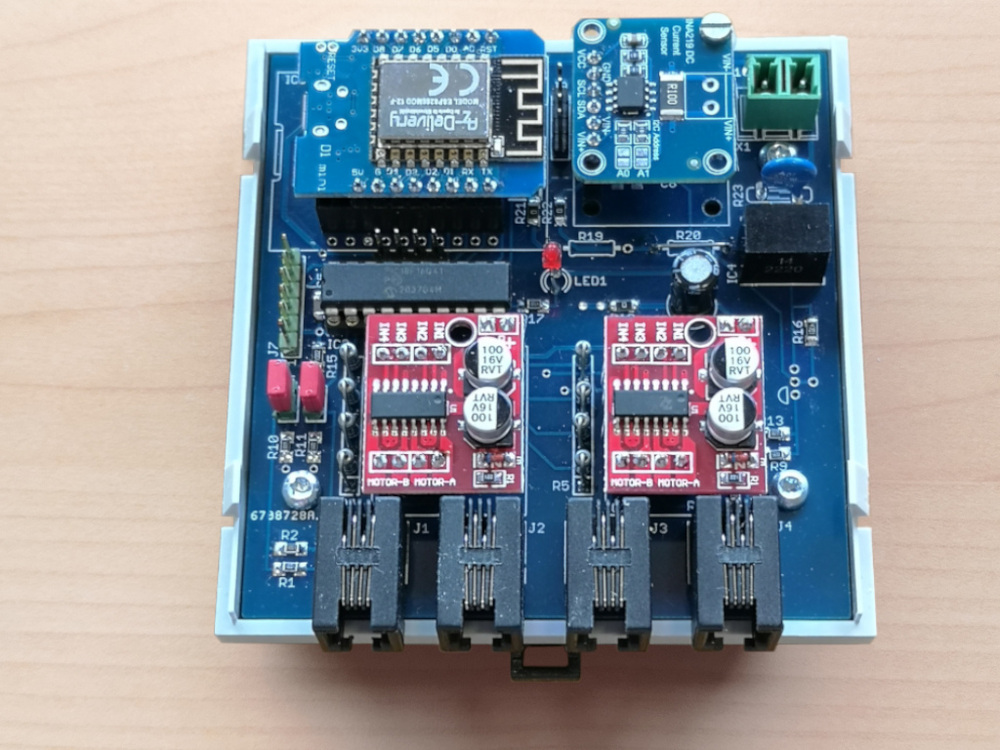

# This folder contains the schematics and hardware description

- [x] A working sample is running using a breadboard.
- [x] First layout and Gerber files are available
- [x] PCB built into housing, first desktop tests have passed
- [ ] Testing under real conditions

## Block diagram
- todo -

## Schematics
- Schematics added as PDF

## Board and housing
- PCB design added as PDF
- PCB preview added
