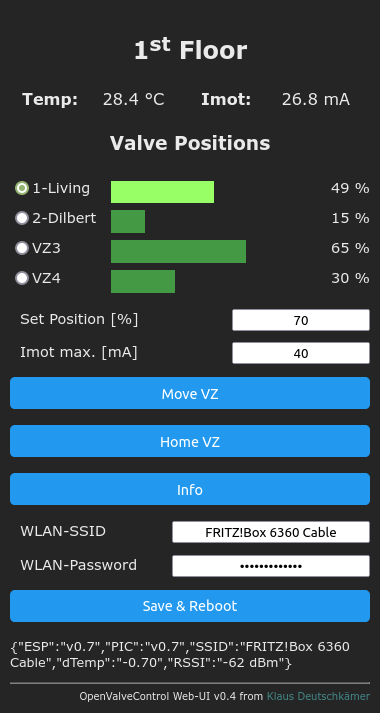

# OpenValveControl
Low cost smart control for motorized 3 V floor heating valve actuators (like HmIP VdMOT and others) with web interface.
The web interface (ESP-ValveControl) uses an ESP8266 D1-mini and the motor control (PIC-ValveControl) uses a PIC18F16Q41.
All components are low cost and pluggable.

<table>
<tr>
<td rowspan="2"></td>
  <td></td>
  <td></td>
</tr>  
<tr>
  <td></td>
  <td></td>  
</tr>  
</table>

# Purpose
The heating control of our home regulates the supply temperature by means of two characteristic curves (slope and offset). 
This works reasonably well in most weather situations. However, if we shut down one room (e.g. the visitor room), the 
characteristic curves are no longer correct. And because our heating only knows whole degrees, it is not possible 
to adjust the temperature by half a degree. So far, we've turned the valves until it was reasonably right again.
To automate these settings, we would like to be able to vary one or more heating circuits via WiFi or a SmartHome interface.
Since our floor valves are on two storeys, we feel that the costs of two Homematic FALMOT (or equivalent clones) are too 
high for this purpose and the documentation is not detailed enough in most cases.
Since I am interested in the whole topic, I started to develop my own solution for this task and make it available 
to the community as an OpenSource project.

# Features
- [x] Connect up to 4 motorized, 3 V floor heating valve actuators (like HmIP VdMOT and similars)
- [x] OLED Display (visualization of valve positions, motor current, temperature and status)
- [x] WiFi-Interface (visualization, command execution and status requests using GET, POST, JSON)
- [x] Supports DS18B20 (heating flow temperature)
- [x] Filesystem support on ESP (upload webserver "/index.html" and setting data "/ovc.ini")
- [x] Access point (until local WiFi has been configured)
- [x] OTA-Support for ESP (Over-the-Air Update)
- [ ] OTA-Support (Over-the-Air Bootloader) for PIC-µC
- [ ] MQTT Support
- [ ] Examples for NodeRed, MQTT, FHEM, Raspberry Pi, ...

# Bill of Materials
- 1 x LOLIN(WEMOS) D1  mini (clone), ca. 5 EUR (e.g. AZ-Delivery)
- 1 x PIC18F16Q41-I/P (20-lead DIP), ca. 2,50 EUR (e.g. Reichelt)
- 2 x MX1508 Brushed DC Motor Driver (each board supports 2 motors), ca. 3 EUR (e.g. Amazon)
- 1 x INA219 Bidirectional Current/Power Monitor With I2C Interface, ca. 4 EUR (e.g. Amazon)
- 1 x DC-DC-Converter TRACO TSR1-2433, ca. 6 EUR (e.g. Reichelt)
- 1 x OLED display 1,3" SH1106-OLED-I2C-128x64, ca. 8 EUR (e.g. AZ-Delivery)
- 4 x RJ11 connectors, ca. 3 EUR (e.g. Amazon B00TX440GO)
- 1 x DS18B20 with cable, ca. 2 EUR (e.g. AZ-Delivery)
- 1 PCB or breadboard, ca. 10 EUR
- Small parts (resistors, diodes, connectors, LED, ..), ca. 2 EUR
- 1 x WITTKOWARE KRA-Z109JFP, DIN rail housing, 90x88x65mm, ca. 7 EUR (+ 5 EUR PP, e.g. Amazon)
- 1 x 5 V / 1 A Power Supply, micro-USB, ca. 10 EUR

Total: ca. 55 EUR (actuators not included - ca. 20 EUR each)

# License
- EUROPEAN UNION PUBLIC LICENCE v. 1.2  
  "The European Union Public Licence (EUPL) is a copyleft free/open source software license created on the initiative of and approved
  by the European Commission in <a href="https://joinup.ec.europa.eu/collection/eupl/eupl-text-eupl-12">23 official languages</a>
  of the European Union."

